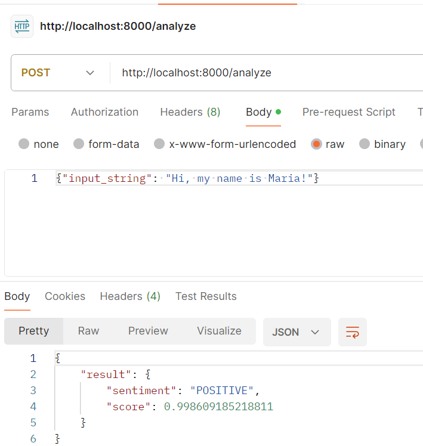

# FastAPI Sentiment Analysis API

Try out this text Data Analysis of sentiments. The model served here by API does a call to hugging face transformers
"sentiment-analysis" and "bertweet-base-sentiment-analysis". The code here is to build a local API using docker, the image setup is as Dockerfile



## Getting Started

### Prerequisites

- Python 3.7 or later
- [Pip](https://pip.pypa.io/en/stable/installation/) (Python package installer)

### Installation

1. Clone the repository:

```bash
git clone https://github.com/mariaob1201/serving_huggf_trained_model_by_apid.git
